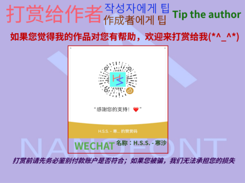

# NanoQyoanDaSong | 纳米全大宋

## 简介
以*全字库正宋體*作为基本进行像素制作的像素风格宋体，44x44大小的字符加上泛中日韩的字符支持

## 收录字形一览
> [!IMPORTANT]
>
> **未打勾**的为不支持或部分支持的区域
>
> **打勾**的为已经全部支持的区域

- 表意文字区域
  - [x] 基本区
  - [x] A区
  - [x] B区
  - [ ] C区
  - [ ] D区
  - [ ] E区
  - [ ] F区
  - [ ] G区
  - [ ] H区
  - [ ] I区
  - [ ] J区
  - [ ] 兼容区
  - [ ] 兼容补充区

- 字符集
  - [ ] [WENZHOU_DIALECT](https://github.com/Hansha2011/WenzhouDialectCharacterTable)
  - [x] GB2312-80
  - [x] GB12345
  - [x] BIG5
  - [x] GBK
  - [ ] 通规
    - [x] 三级字以外
    - [ ] 三级字
  - [ ] GB18030-L2
  - [ ] GB18030-L3
  - [x] CNS11643
  - [ ] ALL-CHUNOM

 
> [!IMPORTANT]
>
> **增加字形和修改字形请点[这里](https://github.com/Hansha2011/NanoOldSong/issues/)，记得开新的*issue*来申报哦~**

## 字体授权
  - `v1.0`：*ISAS字体包*授权
  - `v2.0-`：*SIL-OFL v1.1*授权

## 打赏给作者

## 制作名单

|单位|名称|来源|
|-|-|-|
|制作者|[**H.S.S. - 寒沙**](https://github.com/Hansha2011/)|Github|

## 联系

QQ: **3582930858**

E-Mail: **3582930858@qq.com**
